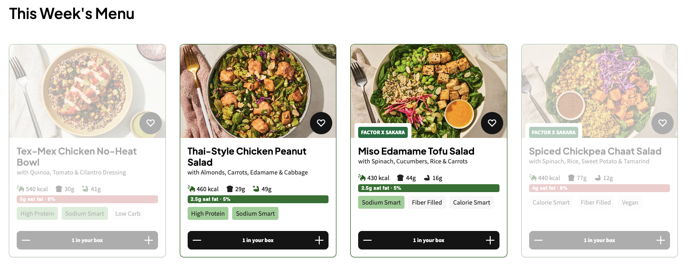
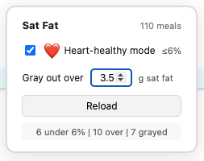

# Factor75 Saturated Fat Filter

A Chrome extension that adds saturated fat information to your [Factor75](https://www.factor75.com) meal selection page.

Each meal card gets a badge showing grams of saturated fat and the percentage of total calories from saturated fat. A floating widget lets you toggle a stricter heart-healthy threshold and gray out meals above a gram limit you set.





## Features

- **Sat fat badges** on every meal card — grams and % of calories
- **Heart-healthy mode** — toggle badge color threshold between ≤10% (default) and ≤6%
- **Gram limit** — enter a number to gray out meals over that amount
- **Auto-loads** on `factor75.com/store*` — handles SPA navigation and lazy-loaded cards
- **No permissions required** — uses your existing login session, no data leaves the page

## Install

1. Download `factor75-satfat-filter.zip` from the [latest release](https://github.com/HachiTogo/factor75-satfat-filter/releases/latest)
2. Unzip it
3. Open Chrome → `chrome://extensions`
4. Enable **Developer mode** (top-right toggle)
5. Click **Load unpacked** → select the unzipped folder
6. Navigate to your Factor75 menu page

## How it works

The extension runs as a content script on `factor75.com/store*`. It reads meal card IDs from the DOM, fetches nutrition data from Factor75's recipe API using your existing session cookie, and overlays badges on each card. A MutationObserver keeps badges applied as you scroll (Factor75 recycles DOM elements via virtualization).

## Release

Push a version tag to create a release with the zip artifact:

```
git tag v0.0.2
git push origin v0.0.2
```

GitHub Actions zips the extension files and attaches the archive to the release automatically.
